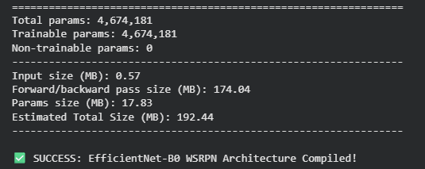
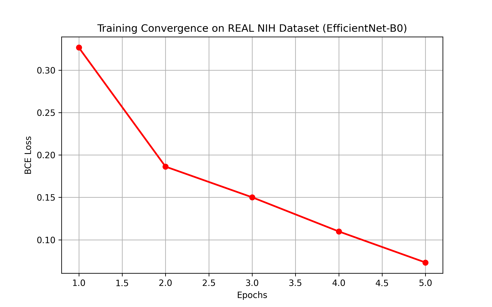

# 🩻 Enhancing Weakly Supervised Disease Localization in Chest X-Rays

An independent PyTorch implementation of the Weakly Supervised ROI Proposal Network (WSRPN) for medical image analysis. 

This project modifies the baseline WSRPN architecture by replacing the computationally heavy DenseNet121 backbone with a highly efficient **EfficientNet-B0**. The model is designed to localize and classify 8 distinct thoracic diseases using only image-level labels (no bounding box supervision required).

## 🚀 Key Architectural Optimizations
The original IEEE paper utilized a DenseNet121 feature extractor containing approximately 8 million parameters. By independently redesigning the backbone with EfficientNet-B0 and implementing a custom attention-based ROI module, this project achieved:
* **41% Reduction in Parameter Count**: Reduced to **4.67 Million** parameters.
* **Low Memory Footprint**: Forward/backward pass size optimized to ~174 MB, making it highly viable for resource-constrained clinical environments.

## 📊 Dataset
Trained and validated on a random sample subset of the official **NIH ChestX-ray8 (CXR8) Dataset**.
* **Composition**: 5,606 real clinical X-Rays.
* **Classes**: Atelectasis, Cardiomegaly, Effusion, Infiltration, Mass, Nodule, Pneumonia, Pneumothorax.

## 📈 Training Convergence & Results
The model was trained using Binary Cross-Entropy (BCE) Loss with Logits to handle the multi-label nature of the diseases. 

As seen below, the EfficientNet-B0 backbone demonstrates immediate and stable convergence on real clinical data, proving its ability to extract highly discriminative pathological features despite the drastically reduced parameter count.

## 🛠️ How to Run
This project uses the Kaggle API to bypass heavy local storage requirements. 
1. Ensure you have your `kaggle.json` API key.
2. Run the data extraction block in the script to pull the 5GB NIH sample directly into your environment.
3. Execute the `train_wsrpn.py` script to initialize the EfficientNet backbone, load the custom `ChestXrayDataset` parser, and begin the training loop.

